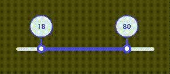

- react-native-range-bar is A dynamic Multi slider bar that response to the touch with react native animation and has a minimum and maximum select.

- It comes with a built-in TypeScript typings and is compatible with all popular JavaScript frameworks. You can use it directly or leverage well-maintained wrapper packages that allow for a more native integration with your frameworks of choice.

# Installation:

```
npm i react-native-range-bar

```

```ruby
yarn add react-native-range-bar

```

# Usage:

```
import MultiSlider from 'react-native-range-bar';


  <MultiSlider
              initialMaxValue={80}
              initialMinValue={18}
              sliderWidth={Dimensions.get('window').width - 100}
              min={0}
              max={100}
              step={1}
              onValueChange={range => {
                console.log('range', range);
                setLImitedAges([range.min, range.max]);
              }}
            />
```

# Example:



> **Dataset Properties**

| Name            | Type                                             |
| --------------- | ------------------------------------------------ |
| min             | number                                           |
| max             | number                                           |
| step            | number                                           |
| initialMinValue | number                                           |
| initialMaxValue | number                                           |
| sliderWidth     | number                                           |
| onValueChange   | ({min, max}: {min: number; max: number}) => void |
| primaryColor?   | string                                           |
| seconderyColor? | string                                           |
